<h1>Cara instalasi Git pada Windows</h1>
Sebelum kita melakukan proses instalasi kita harus menyiapkan aplikasi editor untuk Git yang akan kita gunakan nantinya seperti sublime text,notepad++ dan lain-lain.

1. Setelah kita selesai download aplikasi git nya [disini](https://git-scm.com/downloads/ "Pergi ke git-scm.com/downloads/") lalu kita klik dua kali pada aplikasi tersebut 

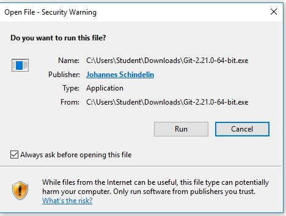 
  Kemudian kita Run aplikasi tersebut.
  
2. Maka selanjutnya akan muncul infomasi mengenai lisensi Git, langsung saja klik Next.

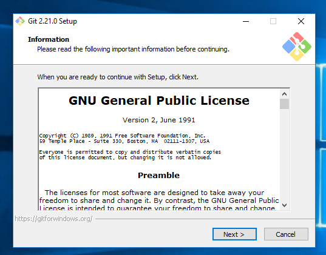 

3. Selanjutnya pemilihan komoponen, biarkan seperti apa yang ada digambar kita langsung klik Next saja.

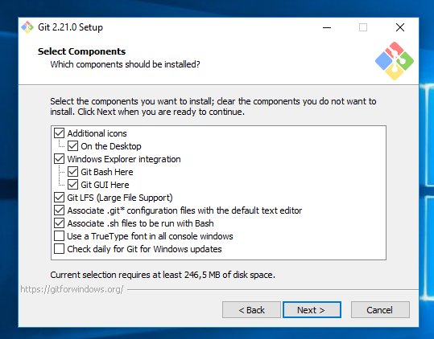 

4. Selanjutnya kita pilih editor apa yang akan kita gunakan untuk Git tersebut,lalu pilih saja yang ada vim nya,lalu Next

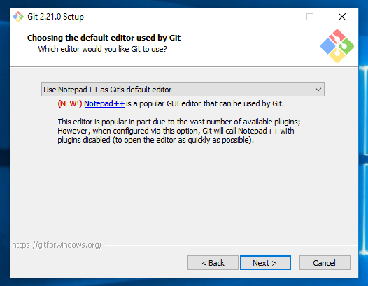 

5. Selanjutnya pengaturan PATH Environment. Pilih yang tengah agar perintah git dapat di kenali di Command Prompt . lalu klik Next untuk melanjutkan proses instalasi.

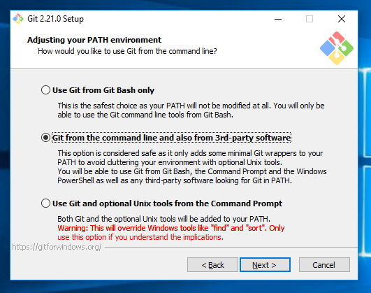

6. Selanjutnya kita akan https nya maka kita pilih saja yang OpenSSL library

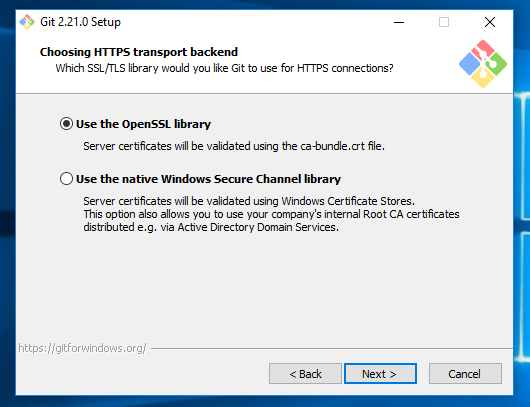 

7. Selanjutnya konfigurasi konversi line ending. Biarkan saja seperti yang ada pada gambar, kemudian klik Next.

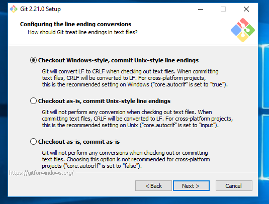 

8. Selanjutnya pemilihan emulator terminal. Langsung kita klik Next saja.

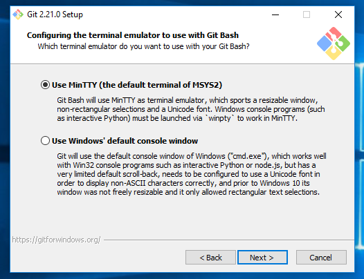 

9. Selanjutnya pemilihan opsi ekstra.Langsung Klik saja Next.

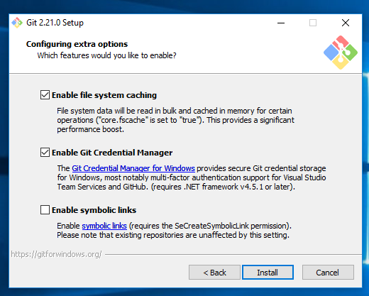

10.Lalu kita tunggu saja proses instalasi yang sedang berjalan

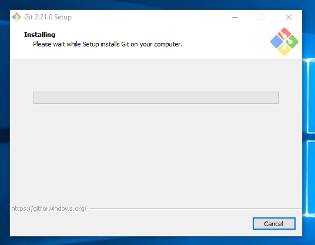

11. Maka proses instalasi pun selesai,kita klik finish saja.

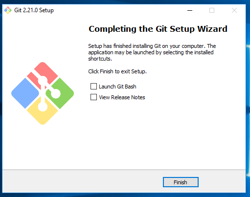

12. Lalu cek apakah aplikasi sudah terinstall atau belum,tulis saja Git pada pencarian di OS yang kita gunakan,lalu kita coba buka saja

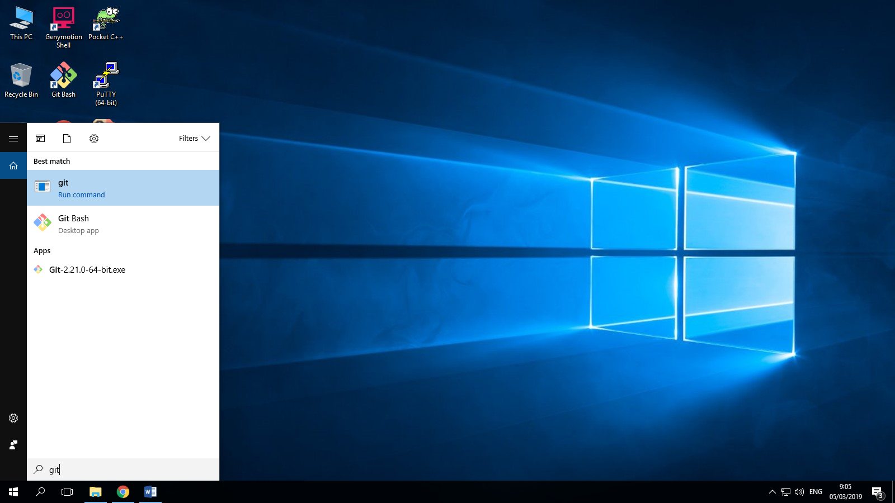

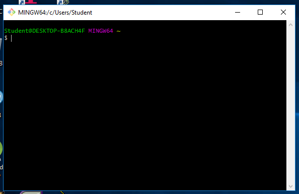

13. Setelah Git terinstall kemudian cek versi Git yang kita gunakan pada Command Prompt dengan mengetikkan perintah git --version.

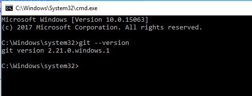

Dan selesai proses instalasi Git sudah selesai dan siap digunakan :) Selamat !
